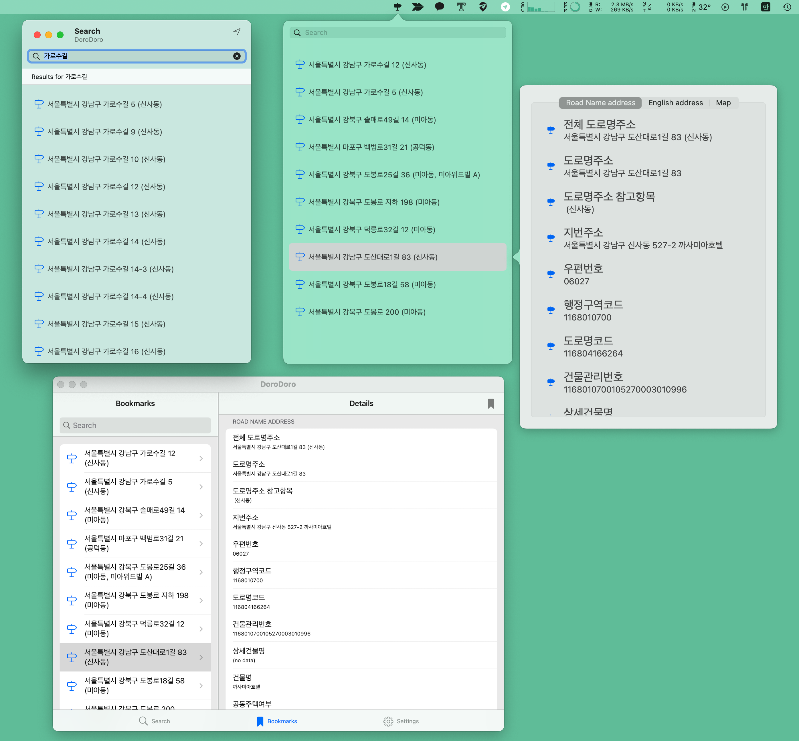

# DoroDoro

iOS/macOS/watchOS용 도로명 및 영문주소 검색 어플

## 기능

- 도로명 및 영문주소 검색 지원
- 책갈피 추가 및 iCloud 동기화 지원
- 지도 크게 보기 지원 및 Apple Maps, 카카오맵 지원
- URL Schemes 지원

## Schemes

### DoroDoro

iOS와 Mac Catalyst를 지원하는 앱입니다. 아래와 같은 특징이 있습니다.

- [UIKit](https://developer.apple.com/documentation/uikit)
- [Combine](https://developer.apple.com/documentation/combine/)
- [UICollectionViewDiffableDataSource](https://developer.apple.com/documentation/uikit/uicollectionviewdiffabledatasource), [NSDiffableDataSourceSnapshot](https://developer.apple.com/documentation/uikit/nsdiffabledatasourcesnapshot)
- [UICollectionLayoutListConfiguration](https://developer.apple.com/documentation/uikit/uicollectionlayoutlistconfiguration), [UICollectionViewListCell](https://developer.apple.com/documentation/uikit/uicollectionviewlistcell)

### DoroDoroWatch

watchOS용 앱입니다. [WatchKit](https://developer.apple.com/documentation/watchkit)과 [Combine](https://developer.apple.com/documentation/combine/)을 사용합니다.

### DoroDoroMac

macOS용 앱입니다. 아래와 같은 특징이 있습니다.

- [AppKit](https://developer.apple.com/documentation/appkit/)
- [Combine](https://developer.apple.com/documentation/combine/)
- [NSTableViewDiffableDataSourceReference](https://developer.apple.com/documentation/appkit/nstableviewdiffabledatasourcereference), [NSDiffableDataSourceSnapshotReference](https://developer.apple.com/documentation/uikit/nsdiffabledatasourcesnapshotreference) : [이걸 쓴 이유](https://pookjw.github.io/Develop/DiffableDataSource-And-Cocoa/article.html)

### DoroDoroTV

tvOS용 앱입니다. **TODO**

### DoroDoroCommon에 대해

`DoroDoro`, `DoroDoroWatch`, `DoroDoroMac`, `DoroDoroTV`가 모두 쓰는 파일들은 [DoroDoroCommon](DoroDoroCommon) 폴더에 담겨 있습니다.

### APICommon에 대해

현재 API Framework들은 `DoroDoroAPI`, `DoroDoroWatchAPI`, `DoroDoroMac`, `DoroDoroTV` 이렇게 있습니다. 이들의 공통되는 파일들은 [DoroDoroAPICommon](DoroDoroAPICommon)에 담겨 있습니다.

## 문서

- [빌드 에러 해결](docs/Build.md)
- [URL Schemes](docs/URL.md)