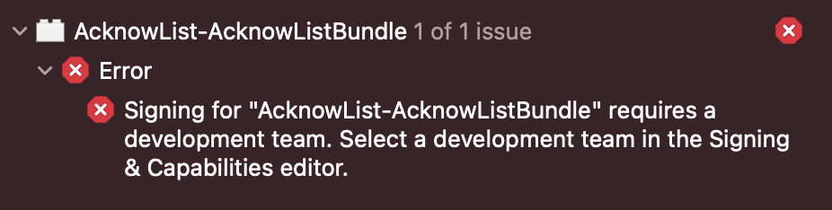

# 빌드 에러 해결

## 모든 Scheme 공통

### API Key 설정

[.gitignore](../.gitignore)에 적혀 있다시피 API Key가 담긴 `Keys.swift` 파일은 Git에 업로드되지 않습니다. 따라서 아래와 같은 `Keys.swift` 파일을 [DoroDoroAPICommon/Keys.swift](DoroDoroAPICommon)에 생성해 주셔야 하고, [DoroDoro/Info.plist](DoroDoro/Info.plist)에 본인의 `KAKAO_APP_KEY`를 써주셔야 합니다.

```swift
import Foundation

/// 도로명주소 API Keys
internal struct AddrAPIKeys {
    /// 도로명주소 API
    internal static let linkAPIKey: String = "<API_KEY>"
    
    /// 영문주소 API
    internal static let engAPIKey: String = "<API_KEY>"
    
    /// 좌표제공 API
    internal static let coordAPIKey: String = "<API_KEY>"
}

/// 카카오 API Keys
internal struct KakaoAPIKeys {
    /// 네이티브 앱 키
    internal static let nativeAppKey: String = "<API_KEY>"
    
    /// REST API 키
    internal static let restAPIKey: String = "<API_KEY>"
    
    /// JavaScript 키
    internal static let javascriptKey: String = "<API_KEY>"
}
```

API Key 발급은 [도로명주소 개발자센터](https://www.juso.go.kr/addrlink/main.do?cPath=99MM)와 [Kakao Developers](https://developers.kakao.com)에서 하실 수 있습니다.

### iCloud Key-value storage 관련

Entitlements에서 `com.apple.developer.ubiquity-kvstore-identifier`의 ID를 본인 Apple ID의 맞게 수정해 주셔야 KVO가 작동합니다. (DoroDoroWatch는 `NSUbiquitousKeyValueStore`를 지원하지 않으므로 해당 사항이 없습니다.)

## DoroDoro Scheme

### AcknowList-AcknowListBundle 인증 문제



```
Signing for "AcknowList-AcknowListBundle" requires a development team. Select a development team in the Signing & Capabilities editor.
```

`AcknowList-AcknowListBundle`에서 Signing에 쓰일 Apple Developer 계정 선택해주면 됩니다.

### DaumMap 관련

현재 DaumMap은 아래 환경에서만 지원하도록 구성했습니다.

- ✅ iOS (arm64)
- ✅ iOS + Simulator (x86_64)

아래는 지원하지 않습니다.

- ❌ iOS (x86_64)
- ❌ iOS + Simulator (arm64)
- ❌ Mac Catalyst (x86_64)
- ❌ Mac Catalyst (arm64)

이런 분기처리는 현재 아래와 같이 합니다.

- Objective-C

  ```objective-c
  #if (TARGET_OS_IOS && __arm64__ && (!TARGET_OS_SIMULATOR) && (!TARGET_OS_UIKITFORMAC)) || (TARGET_OS_SIMULATOR && (__x86_64__))
  /* */
  #endif
  ```

- Swift

  ```swift
  #if ((os(iOS)) && (arch(arm64)) && (!(targetEnvironment(simulator))) && (!targetEnvironment(macCatalyst))) || ((targetEnvironment(simulator) && (arch(x86_64))))
  /* */
  #endif
  ```

이런 분기처리는 [DoroDoro-Bridging-Header.h](DoroDoro/DoroDoro-Bridging-Header.h)와 [MapViewController.swift](DoroDoro/View/Map/MapViewController.swift)에서만 쓰이고 있습니다. 만약 사용하고 계신 환경에서 이 분기처리가 적용되지 않는다면 수정해 주세요.

